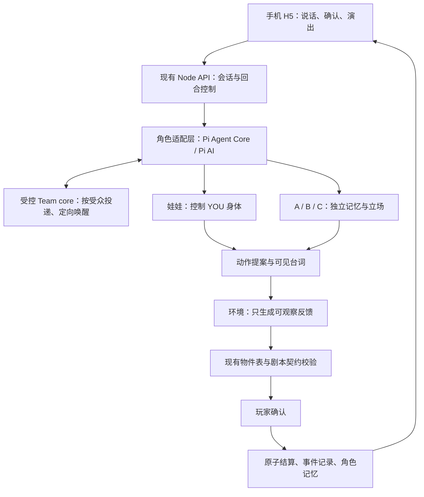

# 0004 · 游戏角色 Agent 运行时选型

日期：2026-09-18（Asia/Shanghai）
状态：**选型已落地到 002 原型；公网部署仍未执行**。用户要求比较框架并选择可行方案；下文版本、限额和落地顺序是工程建议，实际实现以 002 的任务与验收证据为准。

## 决定

**首选 Pi Agent Core + Pi AI；需要角色私聊、接话时，受控复用社区 Pi Team 的独立调度核心。LangGraph JS 为唯一主备选。**

角色运行时采用 `@earendil-works/pi-agent-core`，模型协议采用同系列 `pi-ai`。复用 `@geminixiang/pi-agent-team` 导出的 `TeamRuntime` 核心，但绕过其默认 coding adapter。前端、房间、寻路、物件表、剧本契约继续使用现有实现。暂不把 DeepSeek Harness、Codex CLI 或 Claude Code Team 放入游戏请求主链。

选择 Pi 的理由是当前服务已是 Node ESM，只有少数固定角色，现有契约已能约束动作；通用工具循环与角色通讯可以复用，接入边界较小。没有证据证明它比其他方案模型效果更好、价格更低或延迟更短。若实现中发现必须重写 Team 调度或为完整协调状态设计恢复系统，按本文退出条件改选 LangGraph JS，不继续堆叠框架。

## 本轮范围与现状

- 本轮任务 **SEL-01**：官方资料比较、独立核心可行性实验、决策与交接，已完成；Pi 接入由 002 的 AR-01–05 承接。验收 **SEL-AC-01** 见末尾。
- 关联需求：002 的 HF-02、HF-06/10/15/16、HF-17c/d/g/h、HF-18–24；001 的 NFR-06（证据与交接）。
- 依赖：现有 `server/orchestrator.js`、`server/model.js`、`shared/script-contract.js`、`shared/cast.js` 和环境动作表。
- 本轮修改责任：本决策、研究证据、`docs/HANDOFF.md`、002 规格中的选型入口。未改业务代码、依赖、配置或服务器。

当前代码是**多角色分别调用模型的编排器**，已通过 Pi Agent Core/Pi AI 与 vendored Team core 接入游戏工具循环；默认并发分支用受控 mailbox 传递公开台词，顺序分支才传前人 transcript。已确认事实、角色记忆与版本由服务端 SQLite 保存并在每幕重建；浏览器 `voodoo-hex-v5` 只保留本机头像和离线分支。讲述文本经用户确认后进入 facts，HF-20 在已确认范围内有实现证据。

“多个角色分别有提示词”已经成立；“独立成员持续互相发消息、能中断并恢复的 Team”尚未集成。

## 比较结果

框架、编码 harness、模型供应商不是同一层。这里按能否作为**游戏服务内的角色运行时**比较，不评判谁更会写代码。

| 候选 | 能直接复用的能力 | 对本游戏的主要缺口或成本 | 结论 |
| --- | --- | --- | --- |
| **Pi Agent Core + Pi AI + 社区 Team core** | Node/TS；自定义工具、有状态循环、事件流、取消；Team core 有独立成员适配器、私邮、组消息、调度 | 社区 Team 与最新 Pi peer 版本不匹配；默认适配器是 coding session；游戏持久化、受众过滤和预算仍须实现 | **首选**，通过独立核心实验，有明确的小范围接入边界 |
| **DeepSeek Harness** | 官方 MIT、Cordis 插件架构；实验 Team 有持久成员表、邮箱、任务 DAG、fresh/fork、冷恢复；自定义 provider | 开发者预览；公开 stdio SDK 没有中途取消单次 prompt，需关闭 runtime；Team 单进程、共享 cwd；游戏 profile 和 host bridge 有适配成本 | 有实力的观察候选，本轮不选主链 |
| **Claude Agent SDK / Claude Code Team** | SDK 有 TS/Python、会话、subagents、自定义工具、取消和预算；Code Team 有成员直聊与任务板 | 官方 Code Team 要交互式会话，SDK/`-p` 不启动 teammates；SDK 子代理不等于直接可嵌入的 Code Team；仍需游戏编排 | 更适合开发和内容工具，当前不选角色 Team 底座 |
| **Codex SDK / app-server** | 服务端启动、继续、恢复 Codex 会话，集成编码 harness；app-server 提供客户端交互协议 | 官方定位主要是编码自动化与工具集成；未建立它提供本游戏所需角色邮箱、局部知识及结算的证据；要管理 harness 生命周期 | 用于开发本项目合适，角色运行时不选 |
| **OpenAI Agents SDK** | TS/Python 通用 agent loop、tools、handoff、agents-as-tools、会话/恢复状态，支持 provider 扩展 | handoff 是交接控制权，agents-as-tools 是经理调用专家；持久 NPC 邮箱和游戏可见性仍需设计；现有网关工具协议未验证 | 可行，但目前没有比 Pi 更直接的 Team 复用收益 |
| **LangGraph JS** | 私有子图状态、跨调用记忆、持久 checkpoint、暂停/恢复、显式并行与顺序图；可自托管，不强制 LangChain 或云服务 | 需定义图、消息路由、角色命名空间；默认子图为每次调用新状态，持续角色要显式配置 | **主备选**；恢复和复杂阶段编排成为主要工作量时改选 |
| **Mastra** | TS 一体化模型/工具、supervisor/subagents、memory、workflow 快照和恢复 | 默认子代理收到父完整上下文、每次 delegation 使用新 thread；需要显式过滤与固定角色会话 | 可行备选，本轮不叠加 |
| **LangChain Deep Agents** | JS harness、子代理、上下文管理、文件系统、LangGraph 持久化与人工介入 | 面向长任务和工作委托；需裁剪文件工具并另做 NPC 通讯；**不是 DeepSeek Harness** | 以后做长篇剧本生产可考虑 |
| **Microsoft Agent Framework** | 多种群聊/顺序/并行/交接编排、工具、会话与 checkpoint；AutoGen/Semantic Kernel 后继 | 当前官方主栈 .NET/Python/Go，现有 Node 项目要新增服务边界 | 当前不选 |
| **CrewAI** | Python Crew 分工、顺序/层级执行、memory、Crew checkpoint、Flow 持久化 | 任务生产流程较合适，持续 NPC 的私有知识与接话仍需改造；新增 Python 服务 | 后台内容生产可考虑，当前不选 |

## 三个关键核查

### Pi 的可复用部分与版本边界

截至调研日，Pi 当前包为 `@earendil-works/pi-agent-core@0.85.1`；旧 `@mariozechner/pi-coding-agent` 已标记弃用。Core 要求 Node ≥22.19.0，当前项目 `engines` 仍允许 Node 20；正式接入必须同步构建与部署运行时，不能只安装包。

`@geminixiang/pi-agent-team@0.3.0` 的 `./core` 导出 `TeamRuntime`。它接收通用 `TeamAgent`（`member/sessionId/act/close` 等），核心运行依赖为 Node crypto 和本包 domain，不要求 TUI 或 coding session。三个假角色适配器已成功运行核心，验证私邮按接收方投递，详见[实验记录](../research/2026-09-18-agent-framework-evidence.md)。

但该包 peer 范围是 Pi coding-agent/tui `>=0.82.1 <0.83.0`，未覆盖 `0.85.1`，且发布的是 TS 源码、相对导入为 `.js`。正式接入应把固定版本的 MIT core 独立构建为小适配包、保留许可与上游版本记录，并测试 Pi Core 适配器；不要用强制忽略 peer 的安装来宣称兼容。**本轮未 vendoring、未改 package.json。**

默认 `PiTeamAgent` 会建立 coding session，继承文件/Shell 工具与部分资源，并共享 cwd。游戏角色使用自己的适配器；Core 的 `Agent` 默认 `tools=[]`，只注入游戏白名单工具。

Team 的 `next()` 可保留成员适配器和它们的历史，但会重置协调轮次。该 TeamRuntime 没有整队 checkpoint/restore；默认成员 JSONL 日志也不等于整队重启恢复。不能把这个限制泛化为 Pi 所有 session API 都不支持保存。

此外，私邮虽按接收方递送，`onActivity` 回调仍含原始私信和 `restricted` 标记；claims、blocked reasons、投票等控制信息对队伍公开。**不能把运行时活动流直接广播到手机，也不能把隐藏剧情放进公共控制字段。**

### DeepSeek Harness 确实有 Team，但 SDK 边界要分清

以官方 commit `ddefc45fbc7f8e46dd73185e68295696d1297887` 为源码依据：实验 Team 支持持久成员、私邮、任务依赖与冷恢复，恢复完整度优于此次测试的 Pi Team core。需要配置 durable session storage；同一队伍只支持单进程，消息去重不是跨进程 exactly-once 保证。

`No mid-turn cancel` 是**公开 stdio SDK wire/client** 的限制。内部 `Agent.cancel()` 和 Team Lead `interrupt()` 存在，若选它可以编写插件或 host adapter 桥接；不能说底层完全不能取消，也不能说现成 SDK 已支持手机用户取消单幕。

npm `latest` 标签也不一致：dsh `0.1.5-rc.2`、sdk-client `0.0.1-rc.1`、Team `0.1.5-alpha.2`；存在统一的 next/alpha 发布线，但未安装验证。源码结论不能无条件移植给任意 latest 包。选择 DeepSeek 模型本身不要求选择这个 harness。

### Claude Team、Codex 与通用 SDK 分层

Claude 官方 Team 文档明确：交互式会话才启动 teammates，Agent SDK 与 `-p` 中仍是普通 subagents。Claude SDK 可以开发多角色应用，但不能把 Code Team 的演示当成服务器 SDK 功能。

Codex SDK 是嵌入 Codex harness 的方式；OpenAI Agents SDK 是由应用掌握工具、状态和部署的通用运行时。它们都能参与开发或构建应用，但不存在“接了 Codex 就自动有游戏角色世界”的保证。此次没有做这些方案与当前聚合网关的工具调用/流式兼容测试。

## 推荐接入方式

Team 是通信机制，不要求人物合作完成同一个目标。比如玩家只告诉娃娃“先让 A 解释”，B 不应直接读到这句话；A 在房间公开说出的辩解，B 才能听到并回应。A、B 可以相互推诿，C 只根据自己见过的事发言。这样框架提供的独立上下文才转化成玩法。

具体分工：

1. **运行时**：每玩家、每角色独立身份和上下文；娃娃/A/B/C/ENV 最多五个模型角色，Z 是本地模板，YOU 不另起 agent。
2. **工具**：`speak`、`proposeMove`、`proposeUse`、`sendMessage` 等返回结构化提案。权限由服务端按角色检查；环境不移动人物，人物不能使用不存在的物件。自由文本不直接成为工具执行指令。
3. **导演/编排器**：用确定性代码组织阶段，普通反应保留现有并发模式；明确需要接话时定向唤醒少数成员。Team 同源广播 wave 会串行处理，不能把默认广播当 HF-22 的低延迟并行实现。ENV 在人物提案后运行。
4. **世界状态与记忆**：模型不直接写权威世界；预演是草稿，只有玩家确认后才原子提交事实性记忆和物件变化。拒绝、取消或过期的提案不可变成已发生事实。
5. **存储**：建议单机先用 SQLite，命名空间至少包含玩家、世界、角色。保存已确认故事事实、事件与版本；角色输入由可见事件重建。无需让 Team 在玩家离线后持续运行。
6. **恢复**：先保证已确认一幕可恢复；重启时未确认生成作废并允许重试，不重放已提交动作。若产品后续要求恢复正在运行的完整邮箱/任务状态，应重新比较 LangGraph 的持久编排收益。
7. **降级**：继续保留无模型模板，单角色失败不拖住整幕。当前模板位于服务端，尚不等于 HF-15 的浏览器断网完整可玩；浏览器 fallback 仍须补齐。

建议试验限额（未实施、非性能承诺）：每幕最多 2 轮互动、实际模型请求最多 8 次（包含重试/环境/建议/总结），并发最多 3；每请求沿用 8 秒上限，整幕 12 秒截止；token 上限在 provider 层独立计数。Team 显式设置 `maxTurns` 和 `actionTimeoutMs`，不要使用默认至少 256 turns 与 5 分钟行动超时。`maxTurns` 计成员行动，不等于真实模型请求或 token 数。

取消信号须传到 provider，并用 `turnId + stateVersion` 拒绝迟到结果。供应商若已接收请求，取消不保证费用为零。手机触控/动画即时反馈不等待模型；后台或空闲时不自动续聊。

## 后续任务与文件责任（均未开始）

本节仅是运行时专项交接，**不替代 002 完整 plan/tasks/acceptance**。业务实现前仍须补齐规格冲突与完整计划；特别是旧 HF-08 拖拽与后补 HF-17a 仅说话冲突，以已确认的后者及决策 0002/0003 为依据统一文档。

| ID | 范围 / 文件责任 | 依赖 | 对应需求 / 验收 | 状态 |
| --- | --- | --- | --- | --- |
| SEL-01 | 本文、研究证据、HANDOFF、002 选型链接 | 现有代码与官方资料 | NFR-06 / SEL-AC-01 | 完成，仅调研选型 |
| AR-01 | 锁 Pi 版本/Node 要求，独立构建 Team core；由集成 agent 唯一修改 package/lock；实现 `server/agents/` | 源码交接基线；SEL-01 | HF-19/21 / AR-AC-01 | 已完成，自动化通过 |
| AR-02 | 模型 adapter、自定义游戏工具、取消/请求计数；负责 `server/agents/` | AR-01 | HF-17d/g/h、HF-19/23 / AR-AC-02/05/06/08 | 已完成，自动化通过 |
| AR-03 | 可见事件、角色记忆、确认事实与持久恢复；实现 `server/state/`；保全旧浏览器档 | AR-01；与 AR-02 冻结接口 | HF-06/10/16/20/21 / AR-AC-03/04/07 | 已完成，自动化通过 |
| AR-04 | 接入定向互聊与现有编排器、ENV、确认/幂等；负责 `server/orchestrator.js`、API 入口 | AR-02/03 | HF-17c/d/g、HF-18/21/22/24 / AR-AC-03/05/06/08 | 已完成，自动化通过 |
| AR-05 | 浏览器断网模板、取消 UI、320–430px；负责 `hex/app.js` 及相关 UI | AR-04 | HF-01/15/18/24 / AR-AC-08/09 | 已完成，自动化通过 |
| AR-06 | 真实模型小样本、两玩家并发、重启/取消、手机与微信记录，更新交接 | AR-04/05；可用测试凭证和环境 | HF-19–24、NFR-06 / 全部 AR-AC | 部分完成：真实网关三幕自测；真机、公网、双玩家压力待验证 |

## 验收与退出条件

| ID | 可复现的验收 | 当前证据 |
| --- | --- | --- |
| SEL-AC-01 | 区分 harness/SDK/模型；覆盖用户指定候选；给出一个首选与理由；来源可追踪；实验与未测项分开 | 本文与[研究记录](../research/2026-09-18-agent-framework-evidence.md)，通过 |
| AR-AC-01 | 生产 Node 版本从干净安装构建 adapter；不加载 coding/TUI；记录来源版本和许可 | **通过**：Pi 0.85.1、Node >=22.19、Team core vendored；`npm test` 与双构建通过 |
| AR-AC-02 | 当前网关经 Pi 完成真实工具调用→工具返回→继续生成，覆盖超时和畸形；工具表仅游戏工具 | **部分通过**：本地 SSE 协议与真实网关自测；三幕中一角色 fallback |
| AR-AC-03 | 娃娃+A+B 连续三轮：A 的公开台词可被 B 引用；玩家私信只进入娃娃；检查模型输入、事件流、日志均不泄漏 | **通过（自动化）**：Pi 上下文、mailbox 与 privacy 断言 |
| AR-AC-04 | 次夜引用同一条已确认事实；纠正后旧事实不回流；旧 `v1`/现有 hex 档保全；重启恢复已确认幕，无重复结算 | **通过（自动化）**：状态/HTTP 测试覆盖 facts、restart、CAS、迁移和幂等 |
| AR-AC-05 | 生成中取消并立即发新请求；旧结果/工具/记忆不得写入新幕；断连接、超时同样处理 | **通过（自动化）**：AbortSignal、turnId/epoch 和迟到响应回归 |
| AR-AC-06 | 最坏路径含重试、建议、环境和工具循环，仍不超过实际请求/token/并发上限；记录耗时和 token，不用 turn 数冒充调用数 | **通过（自动化）**：budget/metrics；真实自测 19 请求 |
| AR-AC-07 | 两玩家同时使用相同 A/B 名称，互不可访问对方会话/头像/事实/事件；猜测会话 ID 不能越权 | **通过（自动化）**：匿名 cookie hash、未知会话与静态路径检查 |
| AR-AC-08 | 非法角色/动作/物件、ENV 越权、多个身体动作被契约拒绝/裁剪；模型无配置/失败仍完成本地演出；已载页面断网也可玩 | **通过（自动化）**：契约/本地站/前端离线测试 |
| AR-AC-09 | 320/390/430px、键盘/前后台/取消路径；iOS 与 Android 微信真实链接独立记录；发布后服务器外请求首页/资源/API 成功 | **部分通过**：390px 桌面主链；320/430、微信真机和公网未测 |

AR-01 先验证干净构建和自定义假适配器；AR-02/03 再共同完成隔离 PoC：三角色、三轮、一个物件、一个私信、一次取消、一次服务重启。通过 AR-AC-01–07 对应的运行时子项后，AR-04 才迁入游戏主链；完整游戏验收仍在 AR-04–06 执行。不要先重构整个前端。若只需小适配即可通过则继续 Pi；若必须改写核心调度、广泛耦合 coding SDK，或需求升级到中途中断后精确恢复整队协调，则暂停迁入，重开本文决策、改选 LangGraph JS，而不是同时装两套主运行时。

本轮无真实模型费用/延迟基准，无公网和真机微信测试；没有依据给框架打“更便宜”“更快”的数值分。

## 主要来源

以下资料于 2026-09-18 实际获取；版本/源码与实时文档的区别见研究记录。

1. [Pi 官方仓库](https://github.com/earendil-works/pi)、[Core 0.85.1](https://www.npmjs.com/package/@earendil-works/pi-agent-core/v/0.85.1)、[Pi Team 固定源码](https://github.com/geminixiang/pi-stuff/tree/1d0342afc21a21d6a111b56a97df81e34ca8d60c/packages/pi-agent-team)。Team 为社区项目，不是 Pi 官方 Team。
2. [DeepSeek Harness](https://github.com/deepseek-ai/deepseek-harness)、[Team 固定版本说明](https://github.com/deepseek-ai/deepseek-harness/blob/ddefc45fbc7f8e46dd73185e68295696d1297887/packages/experimental/agent-team/README.md)、[SDK 取消限制](https://github.com/deepseek-ai/deepseek-harness/blob/ddefc45fbc7f8e46dd73185e68295696d1297887/packages/sdk/client/README.md)、[provider 文档](https://deepseek-harness.github.io/deepseek-harness/en/guide/providers)。
3. [Claude Code Agent Teams](https://code.claude.com/docs/en/agent-teams)、[官方 Claude SDK 仓库](https://github.com/anthropics/claude-agent-sdk-typescript)。SDK 能力另核对官方 npm `0.3.276` 类型声明；部分 SDK 网页返回 403，未当成功证据。
4. [Codex SDK](https://learn.chatgpt.com/docs/codex-sdk)、[OpenAI Agents SDK](https://developers.openai.com/api/docs/guides/agents/sdk)、[编排与 handoff](https://developers.openai.com/api/docs/guides/agents/orchestration)、[provider](https://developers.openai.com/api/docs/guides/agents/models)。
5. [LangGraph 子图与私有状态](https://docs.langchain.com/oss/javascript/langgraph/use-subgraphs)、[持久化](https://docs.langchain.com/oss/javascript/langgraph/persistence)。持久化需配置后端，MemorySaver 不抗重启。
6. [Mastra 子代理](https://mastra.ai/docs/subagents)、[暂停恢复](https://mastra.ai/docs/workflows/suspend-and-resume)、[Deep Agents JS](https://docs.langchain.com/oss/javascript/deepagents/overview)。
7. [Microsoft Agent Framework](https://learn.microsoft.com/en-us/agent-framework/overview/)、[CrewAI Crews](https://docs.crewai.com/en/concepts/crews)、[CrewAI Flows](https://docs.crewai.com/en/concepts/flows)。
