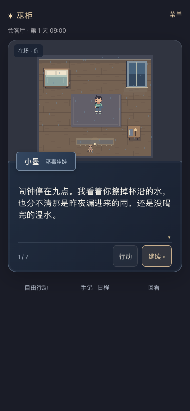
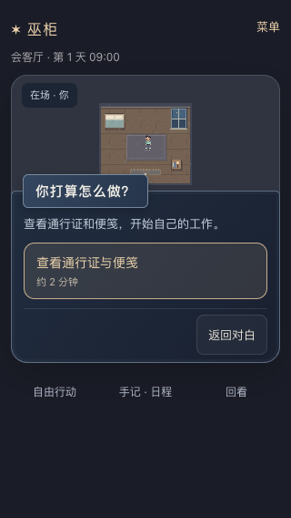

# 2026-09-20 · 阅读焦点、娃娃叙述与推荐行动验证

MW-33 / SP-18 / MW-AC-33 的本机桌面浏览器范围通过。微信真机、公网 HTTPS、完整故障矩阵和长篇故事质量未验收。本次证据来自修改后的代码，不引用前轮通过数量作为本轮结果。

## 实际改动

用户确认：文字太多、不知道看哪里、交互不便，旁白应由巫毒娃娃承担。具体实现默认：

- 当前对话与推荐选项在同一窗内切换，地点/时钟只显示一处；故事库、导入导出在菜单内，自由行动、手记日程和回看默认收起。
- 所有公开 narration 在展示时归于自定义娃娃名；人物对白、玩家心声保持本人。旧阅读缓存保留位置并升级归属。12处教程叙述调整为娃娃的观察/记忆，不替玩家读心。ENV 的权威事件来源不改。
- 读完仅展开行动。推荐按钮一次点击串联已有 intent→confirm；自由输入仍保留可见预览、确认和取消。没有改变时钟、证据、NPC日程、结局、模板和存档协议。
- 新段落去掉重复环境回声；同段探索仍反馈动作结果，NPC回应保留。

## 环境与证据

- 本机 Python 3.9、Node 22，Chrome 153.0.8010.52 无头浏览器。无模型配置。
- 三路线独立测试服务 `127.0.0.1:18770`，SQLite `/tmp/voodoo-focus-playtest-20260920.sqlite3`；故障矩阵使用独立18771服务/数据库。测试未清理用户会话或原库。
- 用户18766入口已更新，沿用 `/tmp/voodoo-review.sqlite3`，更新前SQLite备份 `/tmp/voodoo-review-before-focus-20260920.sqlite3`。
- `npm test`：99/99；Python unittest：159/159；`npm run typecheck`、两套构建、`compileall`、`git diff --check`通过。
- [源码校验值](2026-09-20-dialogue-focus-hashes.json)、[三路线报告](2026-09-20-dialogue-focus-browser.json)、[键盘与恢复390](2026-09-20-dialogue-focus-keyboard.json)、[键盘与恢复320](2026-09-20-dialogue-focus-keyboard-320.json)、[故障矩阵](2026-09-20-dialogue-focus-faults.json)、[多标签状态恢复](2026-09-20-dialogue-focus-stale.json)、[本机HTTP](2026-09-20-dialogue-focus-http.json)。

## 验收矩阵

| 子项 | 实际结果 |
| --- | --- |
| A 阅读焦点 | 390×844、320×568、680×900三路线截图/DOM检查无横向溢出，阅读时无重复大段说明或可见剧情按钮；读完首个推荐在视口内。见下方截图 |
| B 娃娃叙述 | 逐句核对narration为“小墨”，YOU仍为“你”、NPC按本人名；旧缓存归属/游标恢复与私密心声过滤有8项dialogue测试；领域事件未修改 |
| C 阅读接行动 | 三路线共455次阅读点击/按键没有产生行动POST；读完后选项可见，日程/回看默认收起且可展开；按住Enter到末句/提前行动不执行推荐，两档手机尺寸均通过 |
| D 推荐一次点击 | 每路线21次行动各只需一次明确点选，分别产生21组intent+confirm，无二次确认卡；双击只有一回合；提交后响应丢失原turn重试保持幂等 |
| D 失败/过期 | 422/409预览不发送confirm；实际同cookie双标签版本冲突按服务端拒绝，刷新只读快照后重新选择，不自动改选。断网保留进度并显示离线动作 |
| E 自由输入与恢复 | 自由输入预览/取消不改世界，保留原文；pending刷新后可取消/重试。成功推荐保留未发送草稿，故事库往返保留唯一canvas；未知输入无需读完即可选择推荐。390/320两档各7项恢复检查通过 |
| 实际完整路线 | trust/站台/390×844：152句点击；protect/厨房/320×568：151句；audit/站台/680×900：152句。每路线22个画面状态/21次世界行动，全部到正确结局，无pageerror |

## 试玩发现并修正

1. 阅读、日程、目标和操作并排堆叠：改为阅读/选择共享对话框与次级面板。
2. 刷新pending后取消丢输入：从pending.text回填。
3. 行动解析时断网仍留在线推荐：保存offline状态，重绘并展开本地行动。
4. Enter连按读完会点首个推荐：焦点转移到无动作的选项容器，不自动聚焦执行按钮。
5. 推荐成功无条件清空未发送输入：只清空已确认的自由输入。
6. 多标签推进后旧页面反复stale：读取新快照并要求重新选择；读取失败保留可重试pending，恢复预览时重新保存，防止另一标签覆盖本机缓存。

## 截图

阅读时只突出当前一句，娃娃承担叙述：

320窄屏读完后，在同一位置选择行动：

## 边界

这是桌面 Chrome 移动视口仿真，不是微信 iOS/Android 真机。自动点击耗时不等于真实完整阅读时长。没有部署公网、增加长篇内容或宣称整体预发布完成。旧v2四类剧情缺陷仍未修，本轮不会把旧存档重置为新故事。
