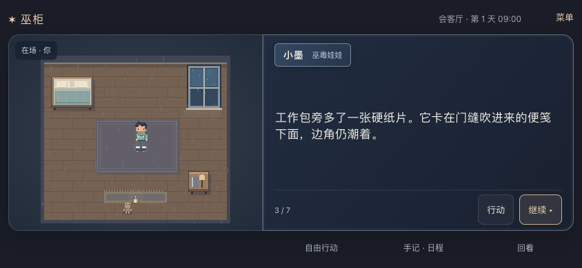
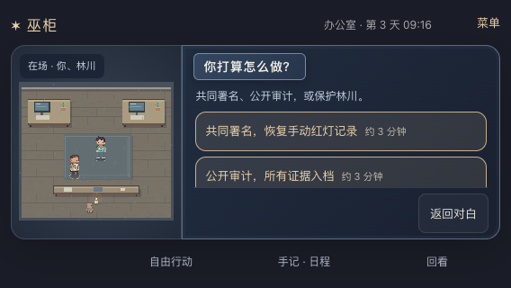
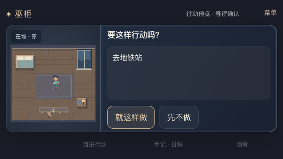

# 2026-09-20 · 横屏优先的手机游戏交互验证

MW-34 / SP-19 / MW-AC-34 A–E 与 F 的桌面模拟范围通过；真实 iOS/Android 微信、安全区与中文软键盘待测。依赖 MW-33，本页使用本轮横屏专项证据。

## 需求与实现

用户确认手机主要横屏操作。实现默认为左侧完整场景、右侧娃娃/人物对话与选择，顶部简短状态、底部次级入口。宽度至少560px且横向视口启用主布局，最大1280px；竖向入口继续可玩并轻提示横屏，不锁定方向，不旋转DOM。

正常横屏阅读、点选无需滚动外层页面；长句、选择列表及次级面板内部滚动，继续/返回/收起保持至少44px触区。自由行动、手记日程、回看覆盖到游戏区域并可收起；展开期间底层舞台不可交互，输入预览或错误会收起覆盖面板，避免遮住确认或推荐。

方向切换仅重排现有节点；VisualViewport只更新显示高度/偏移，不重建世界、舞台、输入或阅读状态。四边安全区有留白，键盘导致可视高度收缩时优先展示输入面板。未改变后端、故事规则、世界时钟、存档格式与预览确认协议。

## 环境与命令

- 桌面Chrome153.0.8010.52；三档横屏844×390、667×375、568×320，竖屏390×844。独立匿名会话，无模型调用。
- 三路线/补充验证：18770与SQLite `/tmp/voodoo-landscape-playtest-20260920.sqlite3`；方向专项使用另一独立18771测试库。测试服务已停止，用户18766继续运行。
- 本轮 `npm test` 99/99、`npm run typecheck`、两套构建和`git diff --check`通过。纯前端变更未重复后端测试，前轮159/159不计为本轮重测。
- 用户18766直接提供新构建，`/healthz`、首页、JS/CSS和动态play包均200。没有重启/迁移/清空用户数据库，也没有公布为公网部署。
- [源码校验值](2026-09-20-landscape-hashes.json)、[本机HTTP](2026-09-20-landscape-http.json)、[三路线](2026-09-20-landscape-browser.json)、[12项方向/面板专项](2026-09-20-landscape-orientation.json)、[竖屏/安全区/长句](2026-09-20-landscape-portrait.json)、[矮屏键盘/确认/错误恢复](2026-09-20-landscape-actions.json)。

## 验收结果

| 子项 | 实际结果 |
| --- | --- |
| A 横屏游戏视口 | 844×390署名/车站、667×375保护/厨房、568×320审计/车站，三日完整通关；每条21次行动/22个画面状态，合计455次阅读。逐场景检查左右分栏、外层不纵向滚动、无横向溢出、底部控件在视口内 |
| B 矮屏与长内容 | 568×320三选项内部滚动后可点末项；长文本布局夹具可滚至末尾，底部继续44px可达。末句连续Enter停在选项容器，不执行行动 |
| C 次级面板与恢复 | 三档地图/日程/回看内部scrollTop改变，关闭按钮经elementFromPoint命中检查。自由输入预览取消、旋转后主动确认和未知动作恢复通过；面板开关零行动POST |
| D 方向状态 | 每档阅读中→竖屏→横屏保持游标，输入草稿保持，pending turnId保持；旋转零intent/confirm。pending后取消世界不变，主动确认只执行一次 |
| E 竖屏兼容 | 390×844阅读/轻提示/面板关闭、故事库往返保留未发送草稿和单一canvas；自由输入预览取消保留、未知输入推荐恢复通过 |
| F 桌面代理 | 三档可视高度缩至240/225/220，中文草稿和预览按钮可见可点。模拟左44/右34/上12/下16px安全区后舞台/导航/面板不越界；仅布局模拟 |
| F 微信iOS/Android | 待测，未将桌面缩小视口当作真机输入法或浏览器栏实测 |

所有浏览器报告无pageerror。已人工查看844阅读、568选择/预览/模拟键盘截图；自动点击运行时间不作为真实阅读时长。

## 实现时解决的问题

- 原竖向堆叠在横屏只剩很小房间画面，需要翻页找操作：改为占满可视高度的横向舞台与阅读区。
- 长内容挤走按钮：正文、选项和面板body单独滚动，底部控件/面板头保留。
- 面板可能挡住行动确认或错误出口：显示预览/错误时收起面板并释放输入焦点；面板打开时底层舞台不可交互，防止误点。
- 方向切换可能诱发重新初始化：使用CSS重排及只读视口变量，保留全部原节点和状态，无需存档迁移。

## 截图

## 边界

仅本机桌面仿真通过。微信真机旋转、刘海/浏览器栏、中文软键盘、公网HTTPS尚未验证。长篇故事质量、真实游玩时长与旧v2剧情缺陷不在本轮布局修复范围；不宣称整体预发布完成。
