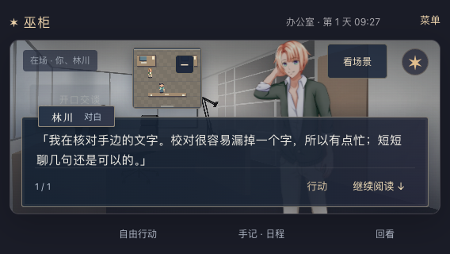
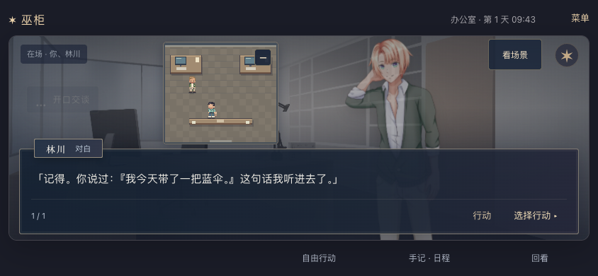
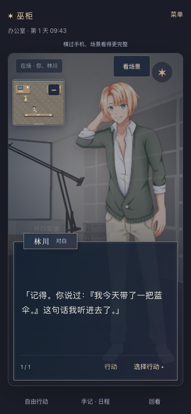

# 2026-09-21 · 林川普通生活对话与记忆接入

对应 MW-43 / SP-28 / MW-AC-43 A–E，接续 MW-10/14/28/31。基线为 `04910f5`。用户要求继续落实多 Agent 世界，本轮先实现一个角色可观察的日常对话闭环；主架构仍为 TypeScript 前端、Python 权威世界内核及 SQLite。具体分流取舍见[决策 0011](../decisions/0011-character-conversation-boundary.md)。

## 行为变化

核查基线中，`signal-rain-v1` 同场 A/B/C 的所有问答都由章节稿接管，普通提问不会到达角色 Adapter。本轮仅将林川 A 的非剧情日常对话交给既有 Adapter 调用链。确认后才生成回复，预览和取消均不调用、不新增角色记忆。关键剧情话题继续使用确定稿件，沈青、周野保持原行为。

请求实际包含本人的名字、人设、性格、目标、当前地点/日程活动、统一时钟与可见记忆。新增嵌套白名单和长度限制，不传全量人物资料、未来日程或全局剧情事实。目标目前用于塑造回应，尚不驱动自主计划。配置缺失、模型失败或输出不合法时，林川可本地回应工作、当前安排、问候、关心和有限回忆。

同场时“自由行动”提供“和林川聊聊工作”“问林川还记得什么”，各约三分钟。离场后不再提供这两个推荐。旧界面直接消费推荐与回应，没有修改前端产品代码或存档格式，也没有自动切换玩家故事。

普通聊天不代替剧情说明或选择结局；时间仍正常消耗，聊得过久可能错过窗口。meeting 需要相关事故话题，第三日 hearing 需要回执/更正预约话题；“提前下班吗”“预约牙医”“茶的来源”等不会跳过说明。第一、三日立场选择只接受有限的明确命令或原推荐：疑问、否定、转述及“共同署名的事明天再说”不作承诺。第一条完整命令子句决定匹配，不宣称支持任意自然语言意图。

## 实际试玩

使用独立临时数据库和浏览器上下文，不接触用户进度。三个尺寸均按实际 UI 完成：进入教程、按推荐抵达办公室、聊工作、确认“我今天带了一把蓝伞”、预览红伞说法后取消、离开办公室、返回并刷新、点击回忆、打开回看，再按剧情推荐继续。

三个尺寸的实际回复均为：

- 工作：“我在核对手边的文字。校对很容易漏掉一个字，所以有点忙；短短聊几句还是可以的。”
- 重访：“记得。你说过：『我今天带了一把蓝伞。』这句话我听进去了。”

取消的红伞不进入回忆；闲聊期间未取得额外剧情证据或跳过 meeting。最终截图已查看，短横屏有继续阅读入口，横竖屏的回忆正文及行动入口可读可用。这些截图中的回复来自无模型本地策略，不是实际供应商生成效果。

## 验证与版本

| 验证 | 结果与范围 |
| --- | --- |
| 最终后端 | 183/183，52.129 秒；含15项角色专项、16项 signal 测试。禁用真实模型配置，使用计数 Adapter 和受控 Gateway transport，见[记录与源码指纹](2026-09-21-character-conversation-backend.json) |
| 浏览器广泛阶段 | 49/49，无页面错误；在最后一次立场命令边界收紧前，见[阶段报告](2026-09-21-character-conversation-browser-stage.json) |
| 最终浏览器相关补测 | 13/13：3个尺寸日常对话、2条取证路线×3种结局、4种错过窗口。全部报告源码指纹与最终代码匹配，见[最终报告](2026-09-21-character-conversation-browser.json) |
| 静态检查 | Python 编译、浏览器脚本语法、差异空白检查通过。本轮前端产品没有变化，未重跑 Node 单元、类型检查或前端构建 |

角色专项通过公开游戏方法到达相应阶段，验证了真实调用边界、本人上下文/他人私密记忆隔离、嵌套多余字段过滤、确认后持久化、取消无调用、重访/重建后的记忆、重复确认不重调用或写入、缺席拒绝、失败回退及原三路线通关。三条纯剧情推荐流程的计数 Adapter 调用为零。最后的命令防误判使用独立新世界流程，确保不是前一个用例已经结束造成假通过。

不把阶段49项与最终13项合称“最终同版49项全部通过”。最终测试和截图来自桌面 Chrome 的手机尺寸，微信 iOS/Android 真机、输入法/软键盘仍待验。

## 本机更新与存档

更新前使用 SQLite backup 备份原库至 `/tmp/voodoo-review-before-character-conversation-20260921-155516.sqlite3`，然后停止已核实的旧 PID 29453，以相同端口、原 `/tmp/voodoo-review.sqlite3` 和 `dist-hex` 启动最终后端。新 PID 14048、工具会话 68702 仅作本次记录，接手时重新核对。

重启前后全部10张表、3,557行内容指纹一致。只读请求本机首页、健康检查与全部27个 JS/CSS/WebP 资源均200，首页和资源与现有构建逐字节匹配。未发送玩家操作 API、未重置或切换用户故事，见[本机 HTTP 与存档指纹](2026-09-21-character-conversation-local.json)。刷新 `http://127.0.0.1:18766/` 后，在 signal 故事与林川同场时可体验；旧模板不会自动变成 signal。仅核查本机，不宣称公网部署。

## 未完成边界

MW-43 A–E 仅关闭以上本机可测范围。真实供应商配置及多轮生成质量没有核验，提示词限制不是事实一致性保证；无模型回忆是对本人有限已提交事件原话的检索，不是完整长期语义记忆。B/C 日常 Agent、自主调整日程、NPC 互聊、承诺影响未来行动、职责模型路由、世界搭建模型入口和模型观察者纠偏仍未完成。整体多 Agent 世界继续保持部分完成。
