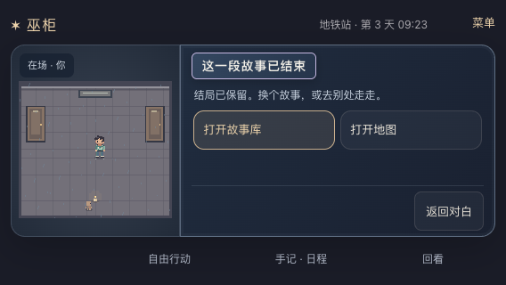

# 2026-09-21 · 结尾后的明确去向与旧档恢复

MW-37 / SP-22 / MW-AC-37 A–F 本机桌面范围通过，依赖 MW-32–36。用户反馈旧 v2 完成页“卡在这里”，不是要求把旧档自动重开或切到新模板。具体两个出口、短屏并排布局及完成态闲聊为本轮实现默认。

## 复现与修复

- 用户原文精确匹配 `rainy-office-v2` 完成态。独立会话通过真实 HTTP 指令走完 21 个推荐步骤，再导入合法旧档复现；观察推进 2 分钟，但再次显示同组普通动作，仍叫“你打算怎么做？”，没有就地的故事库/地图入口。不是后端按钮锁死。
- [旧界面失败记录](2026-09-21-ending-exit-before.json) 使用旧前端构建，后端文案当时已进入本轮修复阶段；该报告用于证明旧 UI 出口缺失，不冒充所有代码都在修复前。用户浏览器接管工具返回 `unsupported Codex auth method: apikey`，因此未操作原用户会话，而是在独立环境复现同模板状态。
- 最终无可玩剧情动作时，读完后显示“这一段故事已结束”，直接提供“打开故事库 / 打开地图”。观察、开门、聊天仍在自由行动中。v1 已完成主线但尚有 `postscript-*` 推荐时继续原支线，不提前显示结束出口。
- 地图浏览不执行世界动作；选择目的地才结算移动和 5 分钟。已结束世界的普通行动只播放本次事件反馈，不因换地点再次演出结尾，阅读缓存仍隔离地点，避免串入另一标签旧对白。
- 故事库打开/返回不写世界，取消新故事草稿后仍有返回入口；确认新故事前沿用原备份链路，时间/章节重开在确认页明确说明。没有存档迁移和旧模板自动升级。
- v2/signal 完成后人物不再邀请玩家去过期的录音窗口或要求重做决定；本篇日程结束，不再暗示有后续剧情任务。v2 结束对白由娃娃总结，避免缺席人物现场发言与上午写成傍晚。三模板最终结束对白标识稳定。

## 实测结果

| 范围 | 结果与证据边界 |
| --- | --- |
| 旧 v2 三视口 | 844×390、568×320、390×844；导入完成档读完、刷新、地图零行动打开、真实移动到地铁站并加 5 分钟、只读本次反馈、原 narrative 不变；故事库往返和取消保留结果；确认 signal 新故事前备份，下载“旧进度”并导回原 v2 结局、地点、day/minute/clockVersion |
| v1 后记 | 568×320；completed 主线仍显示后记入口；实点 6 次推荐完成后记后才显示结尾出口；主线 ending 保持，刷新可恢复 |
| signal 与恢复回归 | 三主动立场 × 两条调查路完整通关，并核对新出口和故事库零行动往返；既有迟到、导入导出、断网、丢确认响应、重启、取消、多标签、坏 pending 和离线保全用例均通过 |
| 完成态普通行动 | 后端对 v2/signal 的 trust/audit/protect 完成后实际执行观察、开门、聊天、跨地点与导入后继续，时间推进且 narrative/证据/ending 不变；v1 后记完成后移动也保持结果。这些是后端实测，浏览器本轮重点实点地图、故事库和后记，没有把所有聊天冒充浏览器实点 |
| 短横屏最终排版 | 最后只缩短结束说明并让两个出口在窄横屏并排。4 项定向复测通过，新增 568×320 说明与两按钮同时可见、无需滚动的断言。已查看 568/844 横屏与 390 竖屏截图 |

[完整浏览器报告](2026-09-21-ending-exit-browser.json)：29/29，265 次计入推荐/移动操作、1,937 次阅读操作，页面异常为空。Desktop Chrome 153.0.8010.52，独立临时数据库、随机端口、隔离浏览器和无模型配置。操作计数不是人类阅读时长。

[最后排版补测](2026-09-21-ending-exit-final-layout.json)：4/4。完整报告对应并排布局前源码，最后报告记录最终源码 SHA256；不篡改此前报告标识。测试编写阶段修正了隐藏面板选择器计数、草稿等待、备份字段层级和导入时钟重新锚定断言，未据这些脚本失败虚报产品通过。完整与最后报告都以真实执行为准。

- `npm test`：113/113。
- `PYTHONPATH=. python3 -m unittest discover -s backend/tests -q`：168/168；叙事两组 58/58。
- `npm run typecheck`、`npm run build`、`npm run hex:build`、`python3 -m compileall -q backend`、`node --check app.js`、脚本语法与 `git diff --check`：通过。
- 可复跑：`PLAYWRIGHT_CHANNEL=chrome npm run test:play`；仅结束专项加 `PLAYTEST_CASE='^ending-'`。

最终截图：

## 本机更新和保全

`http://127.0.0.1:18766/` 已更新到修复构建，Python 已重启，继续使用 `/tmp/voodoo-review.sqlite3`。更新前备份 `/tmp/voodoo-review-before-ending-exit-20260921-012420.sqlite3`；重启前后全部 10 张表、3,368 行内容指纹完全相同，不输出会话密钥或用户正文。PID 66269、工具会话 28045 为启动记录，接手应核对实际状态。

[HTTP/资产证据](2026-09-21-ending-exit-http.json)：健康、首页与全部 15 个 JS/CSS 返回 200；首页及资产字节与最终构建匹配。这里只证明本机服务可用，未声称公网部署。独立试玩服务均在回归退出时关闭，用户库未用于测试操作。

本轮没有扩成长篇，也没有实现完整的结束后持续生活剧情。v2 完成态的缺席对白/时段误导已修，正文阶段的其他离场对白、最终决定误触、missed 覆盖及时间/证据文案仍待修。微信 iOS/Android 真机、真实触摸/软键盘与公网仍另验。
