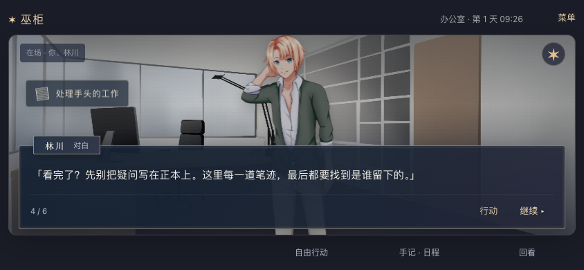

# 2026-09-21 · Galgame 人物、场景与动作表现

MW-38 / SP-23 / MW-AC-38 A–F 本机桌面范围通过，依赖 MW-33–37。用户要求界面像 Galgame，并指出人物贴画和动作细节缺失；具体资产、轻量动画和模块划分为本轮实现默认，见 [决策 0009](../decisions/0009-galgame-presentation.md)。

## 实际改动

- 默认单人入口从像素房间与侧栏改为全幅场景、人物立绘和底部统一对白/选择窗。保留自由行动、地图、手记、回看和故事库；巫毒娃娃继续作为旁白。
- 林川、沈青、周野三人共十张实际表情差分；六张背景覆盖卧室、厨房、走廊、客厅、办公室、车站。人物为 Kainico 的现有现代服装素材，背景包括插画和车站照片；不是项目原创角色设计。表情只能选用各人物已有差分，否则保留其默认表情。
- 在场立绘最多同时显示三人，优先保留当前公开说话者；离开地点或日程到期会退场。说话突出、旁白徽记和玩家心声有区别；不读取 NPC 私密记忆。
- 场景淡入、进退场、说话时轻微晃动，以及确认后的开关、观察、移动、工作、等待、交谈短提示。动作由回执驱动并按 eventId 去重，不改变世界时间/位置/关系，不重复提交。预览、取消、阅读和刷新不演成新行动。
- 图片失败显示角色名字和渐变背景，减少动态时关闭非必要动画。缺少背景的其他地点不冒用已画的办公室/卧室；未知人物使用名字回退。
- 原世界与存档协议未改动。离线仍能按原规则玩，本轮未补齐离线同等动作短演出。原 PixiJS 舞台保留于旧模式。

## 试玩与修复

使用独立临时 SQLite、随机端口和 Chrome 153.0.8010.52，不接管用户游戏会话、不加载模型配置。

[完整浏览器报告](2026-09-21-galgame-stage-browser.json)：**35/35**，287 次计入行动、2,452 次阅读操作，无页面异常。包含原 29 项和新增六项；脚本速度不是人类游玩时长。

| 验证范围 | 实际结果 |
| --- | --- |
| 四尺寸新舞台 | 844×390、568×320、390×844、320×568；通过真实推荐走完观察、开门、通勤到办公室，再预览/取消/确认办公桌动作；林川立绘加载、说话高亮、玩家心声、娃娃旁白可辨 |
| 动作与位置 | 每次演出 ID 对应本次确认回执；推荐只发一次 intent+confirm；取消不产生 cue、不改世界；实际移往车站后林川退场；刷新不重演 |
| 预览与署名 | 正文至少有完整一行可读空间，确认/取消按钮至少 44px 且位于窗内、视口内、无遮挡；普通场景四尺寸和旧 v2 结尾三尺寸均验证；打开署名再返回不提交动作、不改阅读位置 |
| 故障与减少动态 | 阻断 WebP 后有姓名/背景回退且可继续工作；减少动态后没有运行中的舞台动画，仍能阅读和确认 |
| 结尾与故事 | signal 三立场×两调查路线完整结束；旧 v2 三尺寸与 v1 后记仍可恢复，地图和故事库可达；568×320 结尾说明、两个出口同时可见，无需滚动 |
| 原恢复边界 | 保留导入导出、实际测试服务重启、错过窗口、离线重连、损坏 pending、确认丢响应、取消失败、多标签旧回执等既有回归 |

实测发现并修复：短横屏行动预览正文被标题/按钮挤没、确认按钮超出对话窗；结尾两个出口底部裁切；结尾选择态样式优先级覆盖预览高度。最终报告包含这些路径的几何与操作断言，未放宽原结尾无需滚动的要求。先前失败报告留在本机 `artifacts/playtest/2026-09-21T03-29-09-081Z/`，不冒充最终通过。

[日程补测](2026-09-21-galgame-stage-schedules.json)：**4/4**，同一最终构建，只补强四个既有 missed 用例的立绘断言。林川第 1 日 09:27→10:27、第 3 日 09:13→12:13，以及周野车站/沈青厨房第 2 日 10:05→12:05，均在等待前真实加载对应立绘，等待后按服务端在场列表完全退场。报告保存前后时钟和画面人物列表。完整报告与补测各自保留真实脚本指纹；补测未修改产品源码。

人工查看了三人的实际场景、四尺寸对白、短屏预览、竖屏提示位置和最窄结尾出口。桌面模拟不代替真实手机触摸、微信输入法、软键盘或安全区。

## 自动化与资产

- `npm test`：120/120，包括七项公开投影与回执测试；不从私密 memory 取得表情、不把普通物品使用冒称工作、不让草稿触发动作。
- `npm run typecheck`、`npm run build`、`npm run hex:build`、试玩脚本语法与 `git diff --check`：通过。
- 本轮未改 Python 后端，未重跑其历史 168 项单元测试。浏览器回归使用真实 Python 服务完成产品操作。
- 16 张 WebP 共 1,637,032 字节，全部与来源清单 SHA256 匹配。人物十张、背景六张；[主体清单](../../hex/assets/vn/manifest.json) 与 [车站来源](../../hex/assets/vn-scenes/sources.json) 分开登记。
- [CREDITS](../../CREDITS.md) 保留作者、原包图层、修改、来源和许可；游戏菜单提供对应来源及完整上游署名链接。Kainico 原条目为 CC BY、未注明版本；镜像汇编的 CC BY-SA 3.0 分别记录，未擅写成原画 CC BY 4.0。原论坛返回验证页，依据为公开镜像的逐作者原始清单。未使用含禁止再分发条款的候选包或历史付费测试素材。

## 本机与保全

检查时此前 18766 进程已退出。先备份为 `/tmp/voodoo-review-before-galgame-stage-20260921-113329.sqlite3`，再用原 `/tmp/voodoo-review.sqlite3` 恢复服务，未创建替代玩家世界。9 张业务表、3,368 行重启前后内容指纹一致；未操作用户浏览器存档。

[HTTP 证据](2026-09-21-galgame-stage-http.json)：`http://127.0.0.1:18766/` 健康、首页及全部 31 个 JS/CSS/WebP 资源返回 200，首页/资源字节与最终构建匹配。PID 29453、工具会话 80991 仅是启动记录，接手应重新核对；独立测试服务在测试结束后退出。这不是公网部署证据。

本轮完成的是有实际素材和回执驱动的轻量 Galgame 舞台。完整姿态/口型/Live2D、巫毒娃娃独立立绘、所有地点美术、原创人物设计、长篇内容和真实微信仍需后续工作；不把这些记作已完成。
