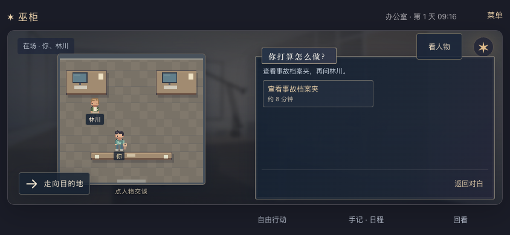
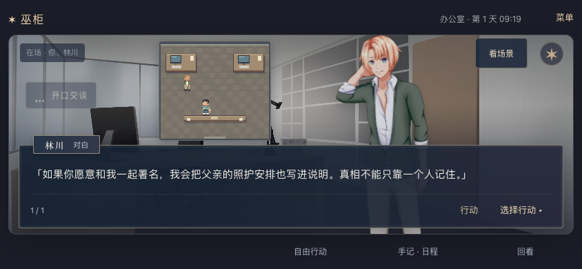

# 2026-09-21 · 俯视探索与 Galgame 对话融合

MW-39 / SP-24 / MW-AC-39 本机桌面范围通过，依赖 MW-33–38。用户确认希望融合此前俯视图和新增人物立绘；探索/阅读的默认构图、手动切换规则与示意站位是实现默认，见[决策 0010](../decisions/0010-hybrid-exploration-presentation.md)。

## 实际结果

- 选择行动时，横屏左侧显示 Pixi 俯视场景，右侧保留原来的对白/选择窗；竖屏上下排列。阅读时放大人物立绘，底部显示同一个对白窗，上方保留小俯视图。没有增加第二份对白或任务面板。
- “看场景 / 看人物”可手动切换；同一阅读/选择阶段内保留选择，阶段、世界、版本或地点变化时恢复默认构图。切换只影响显示，不推进时间、阅读、动作演出或世界版本。
- 点场景里的在场 NPC 进入原有交谈预览，确认后才提交行动；取消不改变世界。预览期间、忙碌和离线时禁用 NPC 热点。确认或取消热点交谈都保留另一个尚未发送的输入草稿。
- 两种画面共用公开世界快照，跟随实际在场与日程退场；YOU 身上附着娃娃，不增加第二个可控身体。俯视图复用本项目像素绘制，覆盖 11 个地点的家具/空间语义；未知地点用空示意，未知人物用姓名标记。
- 室内站位只用于摆放画面，不解释后端坐标为像素网格，不写回存档。本轮没有新增自由走路、寻路或家具点击规则。已有地图、自由输入、手记、回看和结尾出口保留。
- Pixi 延后加载，失败时给出场景回退，阅读/行动仍可继续。浏览器隐藏、阅读模式和减少动态偏好下停用俯视动画循环。主舞台实例保留，重建时停止演出并重新观察当前对白尺寸；适配器另有实际释放方法，不声称每次离开面板均销毁整个渲染器。

## 真实浏览器回归

[最终完整报告](2026-09-21-hybrid-stage-browser.json)：**40/40**，Chrome 153.0.8010.52，311 次计入行动、2,676 次阅读操作，页面异常为空。使用随机端口、临时 SQLite 和独立浏览器会话；没有打开或更改用户故事。脚本速度不代表真实阅读时长。

| 覆盖项 | 证据 |
| --- | --- |
| 四尺寸融合 | 844×390、568×320、390×844、320×568；真实观察、开门、通勤到办公室，实际 canvas 加载，NPC 目标至少 44px 且可点击，探索图大于阅读小图 |
| 只读视角 | 自动切换与反复手动切换不产生 POST、不改世界版本/时间、阅读位置或动作回执 |
| 场景交谈 | NPC 点击只产生一次草稿预览；取消只取消，确认才执行一次；两条路径均保留另一段自由输入 |
| 屏幕旋转 | 阅读位置、输入草稿和待确认预览保持；等待浏览器真实尺寸及页面视口变量更新后检查按钮完整可见且无遮挡 |
| NPC 日程 | 第一天/第三天林川、第二天周野/沈青到期后，同时从俯视图和立绘退出，报告保存前后时钟与人物列表 |
| 图形故障 | 禁用 WebGL 后实际初始化失败，仍可翻页、推荐行动、预览及确认；取消另由正常渲染场景验证，阻断立绘时保留姓名回退 |
| 原路径 | 三立场×两调查路线通关、旧 v2 结尾与 v1 后记、地图/故事库、导入导出、重启、离线重连、损坏 pending、确认丢响应、取消失败与多标签旧回执均通过 |

人工查看了最终 844×390、568×320 的探索和人物对白、320×568 探索，以及图形失败截图。短横屏地图面积有限，对话时小图只用于位置概览，可通过“看场景”放大。减少动态浏览器用例验证 DOM 动画；Pixi 停帧策略另由实现检查及适配器专项检查覆盖，不声称实机功耗达标。

开发过程发现并修复：图形初始化失败后遗留已销毁引用会打断下一句；手动切到人物时小俯视图与较高选择窗重叠；点 NPC 后确认会清掉不同内容的草稿。旋转测试改为等待真实布局完成，没有放宽确认按钮的可见范围。先前两次失败报告保留在本机 `artifacts/playtest/2026-09-21T03-53-47-498Z/`、`2026-09-21T03-58-17-594Z/`；本页只以最终 40 项通过报告验收。

## 自动化、构建与本机服务

- `npm test`：**125/125**，新增五项公开投影测试，覆盖不读取私密记忆/未定义坐标、11 场景语义、家具避让、未知角色、离场与无状态修改。
- `npm run typecheck`、`npm run build`、`npm run hex:build`、脚本语法与 `git diff --check` 通过。最终浏览器报告中的全部源码和构建入口 SHA256 与归档时工作区匹配。
- 没有改动 Python/API/存档协议，本轮没有重跑历史 Python 单元测试；浏览器通过真实 Python 服务完成操作。
- 没有新增第三方图片资产；沿用十张人物表情与六张背景，像素配色与立绘相近，非精确复刻。署名见 [CREDITS](../../CREDITS.md)。Pixi 动态包约 890 KB（gzip 256 KB），构建仍有大包提醒；本轮不宣称首屏网络/内存预算已达标。
- [只读 HTTP 检查](2026-09-21-hybrid-stage-http.json)：本机 `http://127.0.0.1:18766/` 的首页、健康和全部 **27 个 JS/CSS/WebP** 文件返回 200，首页和每个资源与最终构建字节一致。资源总数变化来自重新分包，不是美术删除。
- 沿用 PID 29453、工具会话 80991 的现有服务和 `/tmp/voodoo-review.sqlite3`，本轮没有重启服务、重置进度或操作玩家会话；刷新即可取得界面。PID 仅为检查记录，接手应重新核对。

这是本机桌面浏览器及移动视口验收，未覆盖微信 iOS/Android 真机、真实软键盘和公网部署。完整步行动画、口型/Live2D、所有场景插画、独立娃娃立绘、长篇剧情及多人物持续生活仍是后续工作。
