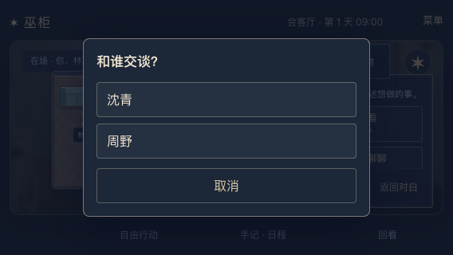
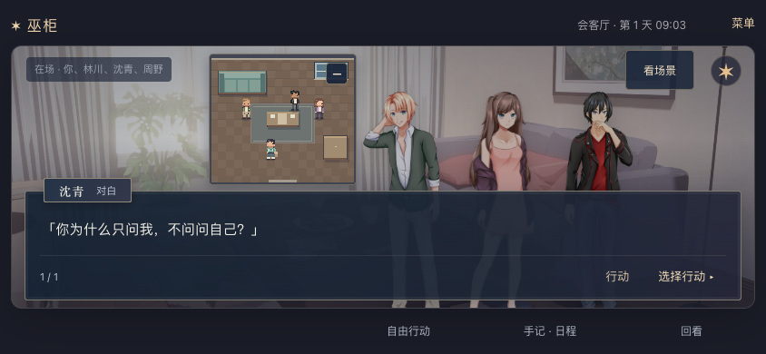

# 2026-09-21 · 多人物点选与立绘避让

MW-41 / SP-26 / MW-AC-41 A–C 本机桌面已测范围完成，依赖 MW-39/40。用户要求继续优化；本轮从实际审查中发现并修复多人误选及脸部遮挡。候选弹窗与具体构图是实现默认，不记作用户逐项指定。

## 缺陷与改动

- 在 568×320 同场 A/B/C 的俯视图中，B/C 的固定 64×56 点击区域重叠；点击沈青身体中心会由上层周野按钮接收。现在真实指针落入多个热点时，先打开“和谁交谈？”候选框，显示该位置涉及的角色；选定后才走原行动预览，确认后才执行。单一热点和键盘明确聚焦的对象保持直接预览。
- 候选框使用原生 modal dialog、至少 44px 按钮和内部滚动；长姓名换行。取消或 Escape 不发送请求，焦点回到原人物；选择前重新检查当前候选、在场展示和操作锁，不能静默改选别人。
- 世界投影更新、交互禁用和舞台停止时关闭候选框，不保留已离场对象。此处不新增实时服务器推送；跨标签真实移动后，当前页刷新才同步新场景，不能冒称后台离场即时到达页面。
- 两至三人立绘上方留出控件空间；窄竖屏重新分配站位与宽度，避免右侧人物的脸被视角按钮覆盖。单人立绘原构图保持。在场名单限制单行并省略，完整文字保留在 title，人物身份仍由对白及选人入口辨认。
- 新增 `hex/play-cast-picker.ts` / `.css`，由 `play-stage.ts` 接入，`play.ts` 引入样式。没有改 API、权威日程、故事、动作确认协议或存档。

## 验证与结果

Chrome 153.0.8010.52，独立临时数据库、随机端口及测试会话；真实 UI 导入合法 v5 三人同场存档，经过后端迁移，非修改用户数据库或伪造前端快照。

| 范围 | 结果 |
| --- | --- |
| 三档真实多人场景 | 568×320、844×390、320×568 均取得通过证据；点 B 身体或 B/C 相交区域只打开准确候选，不发请求。取消保持游戏状态；选 B 的预览 `preview.target` 为 B，键盘聚焦 B 确认后真实回执 YOU→B |
| 候选可达与保全 | 44px 触区、无遮挡、旋转、12 字合法长姓名、输入与阅读保持、取消零请求；另一个标签页真实移动后刷新，旧候选关闭且新在场正确 |
| 单人及既有路径 | 18 个相关回归均取得通过证据：四尺寸小图收放/旋转、图形失败、四尺寸原舞台、减少动态、图片失败、旧 v2 三尺寸结束和 v1 后记、存档恢复、确认丢响应重试、离线取消 |
| 生命周期组件 | 单独挂载实际舞台的展示 fixture，`update` 使 B 离场、`setInteractionEnabled(false)`、`settle()` 三项均关闭已打开窗口且零 callback；明确独立于后端产品流程 |

报告保留真实首次结果与同版本补测：

- [多人首轮](2026-09-21-multicast-stage-browser-initial.json)：2/3；844/320 完成。568 已通过点选和候选几何，随后截图等待 10 秒超时；[568 单项复测](2026-09-21-multicast-stage-browser-568.json)通过。
- [相关回归首轮](2026-09-21-multicast-stage-regression-initial.json)：17/18；390 竖屏在一段普通阅读点击等待 10 秒超时，失败截图保留，页面无异常；[390 单项复测](2026-09-21-multicast-stage-regression-390.json)通过。未确定超时根因，不以复测通过证明永不发生。
- [组件生命周期](2026-09-21-multicast-stage-lifecycle.json)：3/3，无页面异常。

两次补测均没有修改代码、构建或断言；所有产品报告的源码和构建入口 SHA256 与最终工作区一致。这里是 **3 项多人 + 18 项相关场景**分批取得通过，不宣称一次 21/21 全绿，更不是全量 43 项重跑。

人工审查三档真实产品的候选框与三人对白截图，头像避开上方按钮，人物与正文可辨；568×320 三人画面人物较小，仍属短横屏取舍。组件临时头像 fixture 不作为产品视觉验收。

## 构建、本机与边界

`npm run typecheck`、`npm run hex:build`、浏览器脚本语法和 `git diff --check` 通过。首次整合遇到 DOM NodeList 缺少 iterable 类型，改用 `Array.from` 后通过。本轮未新增或重跑 Node/Python 单元测试及根目录构建；旧 Pixi 动态包的大包提醒保留，没有新增依赖或图片资产。

[HTTP 检查](2026-09-21-multicast-stage-http.json)：本机 18766 的首页、健康和全部 27 个 JS/CSS/WebP 文件 200，首页及资源字节匹配最终构建。沿用原服务和 `/tmp/voodoo-review.sqlite3`，没有重启、清档或操作用户会话；刷新取得新版。独立测试服务结束后退出。GitHub 同步不等于公网部署。

微信真机、真实触摸/软键盘、所有自定义人物构图、实时跨标签推送和公网仍未验证。当前多人立绘最多显示三人并优先保留当前说话者；不把本次 UI 修复视为完整生活模拟、长篇内容或全部预发布完成。
