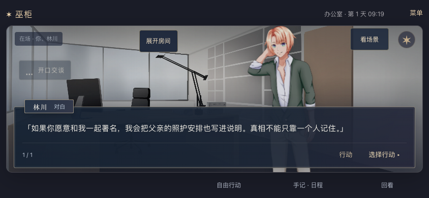

# 2026-09-21 · 立绘模式小俯视房间收放

MW-40 / SP-25 / MW-AC-40 A–C 本机桌面范围完成，依赖 MW-39。用户要求立绘展示过程中能自由最小化俯视房间；默认展开、按钮位置及偏好保存范围为实现默认。

## 行为

- 小图右上角“−”收起画面，仅保留“展开房间”按钮。收起/展开触区分别为 44×44 / 76×44，具有完整的可访问名称与展开状态。探索时始终显示完整房间；回立绘后恢复此前小图偏好。
- 本机 `voodoo-overview-collapsed` 独立保存显示偏好，翻页、换场和刷新保持，不写入游戏存档。读写失败使用内存状态，仍能收放。
- 视角切换和小图收放在待确认或请求中仍可用；人物交互、输入、确认等继续遵守原锁定规则。导入过程同样只豁免两种显示控件。它们不提交请求，不修改世界/时间/阅读/草稿/pending，也不重播行动。
- 修改范围为 `hex/play-stage.ts`、`hex/play-stage.css` 和 `hex/play.ts`；没有 API、世界内核或存档迁移。

## 实际验证

[融合专项](2026-09-21-overview-disclosure-browser.json)：**5/5**，Chrome 153.0.8010.52。四尺寸 844×390、568×320、390×844、320×568 共 **26 次真实收放检查**，覆盖收起/展开两种偏好跨刷新、阅读翻页、通勤换场、探索往返、横竖旋转、NPC 预览中的收放与确认/取消，以及保留未发送输入。每次收放检查完整游戏缓存、当前输入、请求数量和行动提示未变。568×320 额外让 UI 偏好键的读取和写入分别抛错，游戏存储照常工作，收放继续可用。原图形初始化失败场景也通过；5 项无页面异常。

[相关回归](2026-09-21-overview-disclosure-regression.json)：**13/13**，同一产品源码、同一脚本和构建。包括四尺寸原舞台、减少动态、立绘失败、旧 v2 三尺寸结尾和 v1 后记、保存恢复、确认丢响应重试、离线取消。两份报告中的全部源码/构建入口 SHA256 与最终工作区相同。

人工审查最终横屏人物对白的收起状态、568×320 展开按钮和小图、390/320 竖屏收起状态。确认小图消失后立绘/对白仍完整，恢复入口可辨。没有新增镜头移动或动画。

首轮 4 个融合尺寸在待确认时无法点击视角按钮，原因是原 `syncControls` 锁住所有按钮；修复为仅放行两种纯显示控件后，最终 5 项通过。失败报告保留于本机 `artifacts/playtest/2026-09-21T04-24-21-897Z/`，不计入最终通过数量。锁定修复前的 10 项旧舞台/结尾结果也未替代最终 13 项。

本轮 `npm run typecheck`、`npm run hex:build`、试玩脚本语法和 `git diff --check` 通过。只执行上述 **18 项相关浏览器场景**，没有重跑整个 40 项套件、Node/Python 单元测试或根目录构建；不沿用历史数量作为本轮结果。沿用 Pixi 动态包的大包提醒，没有新增依赖或图片。

请求正在传输/导入过程中切换控件属于实现检查，本轮实际点击证据是已显示的待确认预览。微信真机、真实软键盘、跨设备偏好同步和公网部署未验证；存储故障仅注入 UI 偏好键，不宣称覆盖浏览器全部存储失效。

## 本机服务与保全

[HTTP 检查](2026-09-21-overview-disclosure-http.json)：`http://127.0.0.1:18766/` 首页、健康和全部 **27 个 JS/CSS/WebP** 资源返回 200，首页及资源与最终构建字节匹配。沿用现有服务及 `/tmp/voodoo-review.sqlite3`，本轮没有重启、操作用户会话或修改玩家存档；刷新可取得新界面。所有试玩使用独立临时数据库/随机端口，测试完成后退出，不作为公网部署证据。
