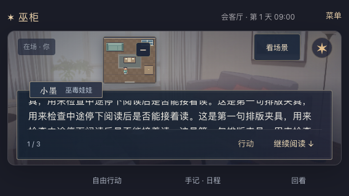
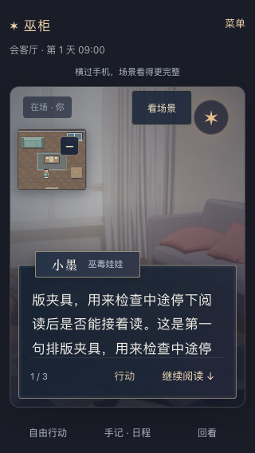

# 2026-09-21 · 返回对白时接着读

MW-42 / SP-27 / MW-AC-42 A–C 本机桌面已测范围完成，依赖 MW-35/40/41。用户要求继续优化；本轮从实际试玩发现句内阅读位置丢失，恢复方式属于实现默认。

## 缺陷与改动

在真实教程的 568×320 开场，第一句需要滚动 7px 才读到末尾。打开自由行动、输入“开门”、预览后取消，世界版本和句索引不变，正文却回到顶部。另一个独立长文字展示夹具复现了读到中段后，经行动窗口返回或取消预览都回到顶部，见[修复前记录](2026-09-21-reading-resume-before.json)。

现在离开可见对白时记住当前句的滚动位置，从行动窗口、预览取消或故事库回到同一句时恢复。新一句或实际执行新行动后从头显示，不跳过未读文字。

产品仅改 `hex/play.ts`。书签在页面内存中每个界面只保留一条，以世界身份/版本、地点、阅读上下文、句索引和实际内容匹配；隐藏窗口及行动预览不会用零值覆盖它。超出当前可滚动范围时限制到末尾。没有新增存档字段、API、模型调用、世界动作或时间推进；刷新仍沿用既有句索引恢复规则，不承诺句内位置跨刷新/设备保留。

## 浏览器证据

Chrome 153.0.8010.52，独立临时 SQLite、随机端口与浏览器会话。未操作 18766 的玩家进度。

| 项目 | 结果 |
| --- | --- |
| 真实教程首句预览取消 | 568×320 的 7→7px、320×568 的 49→49px；844×390 该句无需滚动，保持 0。世界快照、阅读状态及“开门”输入保持，pending 清除，没有 confirm 请求 |
| 长句中段恢复 | 568×320、844×390、320×568 的已读位置分别为 111、129、216px。行动返回、预览取消、故事库返回三条路径均保持原位置和句索引 |
| 下一句 | 三档从头显示；第一次继续只滚动第二句，不跳到第三句 |
| 新行动 | 真实“开门”确认收到新回执，世界版本 2→3；真实对白恢复，index=0、scrollTop=0，不继承旧夹具位置 |
| 相关回归 | 21/21：3 项多人点选、5 项融合舞台/小图、6 项立绘/降级、4 项结尾、3 项存档恢复/确认重试/离线取消；无页面异常 |

长句测试明确只替换独立浏览器的三句阅读缓存，用于验证排版；没有替换后端故事、世界快照或行动结果，不作为新增剧情或可玩时长证据。真实教程首句和最终行动均通过原后端接口。

- [专项首跑](2026-09-21-reading-resume-browser-initial.json)：3 项均在核对第二句文字时失败，测试正则漏了心声原有的中文左括号。此前的同句恢复断言已通过。修正预期文字并补故事库往返后，[最终专项](2026-09-21-reading-resume-browser.json) 3/3；产品及构建未变，测试脚本有变化，不称同源码重跑。
- [相关回归](2026-09-21-reading-resume-regression.json)：21/21，一次完成。
- 最终专项和相关回归内的 `sources` SHA256 均匹配最终源码及构建入口；首跑报告按原样保留。

执行命令：

```bash
PLAYTEST_CASE='^reading-resume' PLAYWRIGHT_CHANNEL=chrome node scripts/playtest-single-player.mjs
PLAYTEST_CASE='^(hybrid-|multi-cast-|vn-|ending-|confirmation-retry$|cancel-without-network$|save-recovery$)' PLAYWRIGHT_CHANNEL=chrome node scripts/playtest-single-player.mjs
```

三档恢复后的截图已人工审查，正文仍有滚动提示，继续阅读、行动和小图收放控件可达。以下重复文字是测试夹具：





## 验收边界与本机状态

- AC-42 A：真实首句与长句三种非执行往返通过。AC-42 B：下一句、真实新版本从头通过；世界 ID、地点、文本独立变化的失效及内存有界来自实现审查，未分别注入浏览器验证。书签未进入保存/导出协议。AC-42 C：往返无额外行动、取消无确认、21 项相关流程通过。
- `npm run typecheck`、`npm run hex:build`、浏览器脚本语法与 `git diff --check` 通过。未重跑 Node/Python 单元、根目录构建或完整 46 项浏览器套件；旧 Pixi 动态包的大包提醒保留。
- [只读 HTTP](2026-09-21-reading-resume-http.json)：18766 首页、健康与全部 27 个 JS/CSS/WebP 文件返回 200，首页和资源字节匹配最终 `dist-hex`。沿用原进程和数据库，没有重启、清档或用户会话写请求；刷新即可取得本轮修复。测试服务退出。
- 微信真机、真实触摸/软键盘、公网与完整长篇质量仍待验。此轮完成范围是当前页的阅读衔接，不等于整体预发布验收完成。
